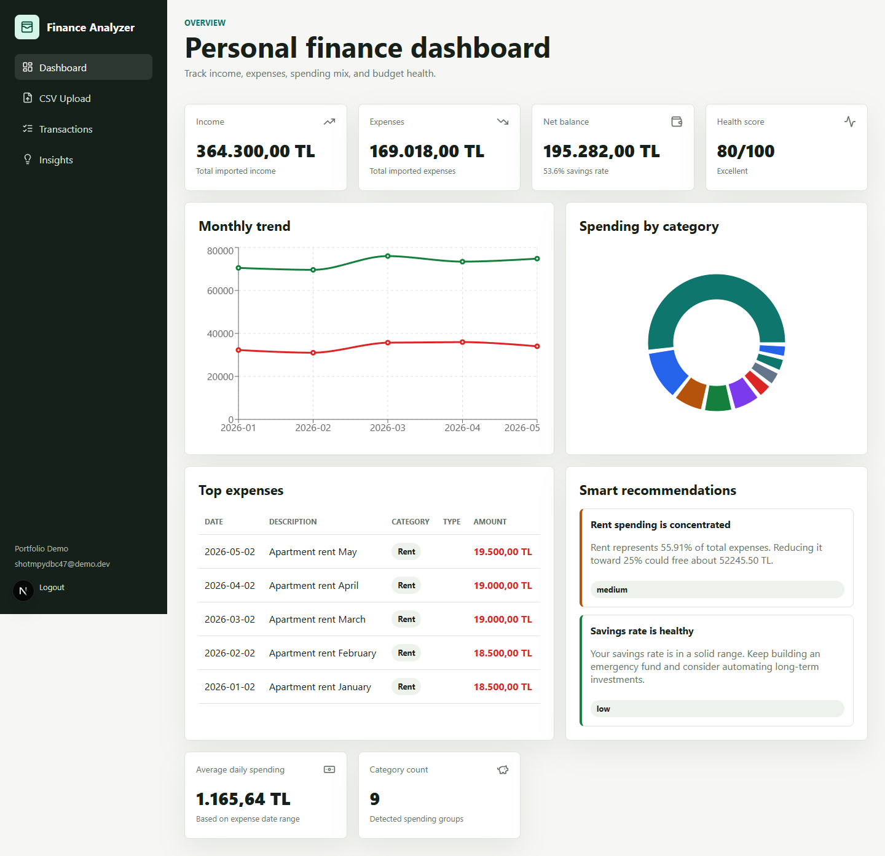
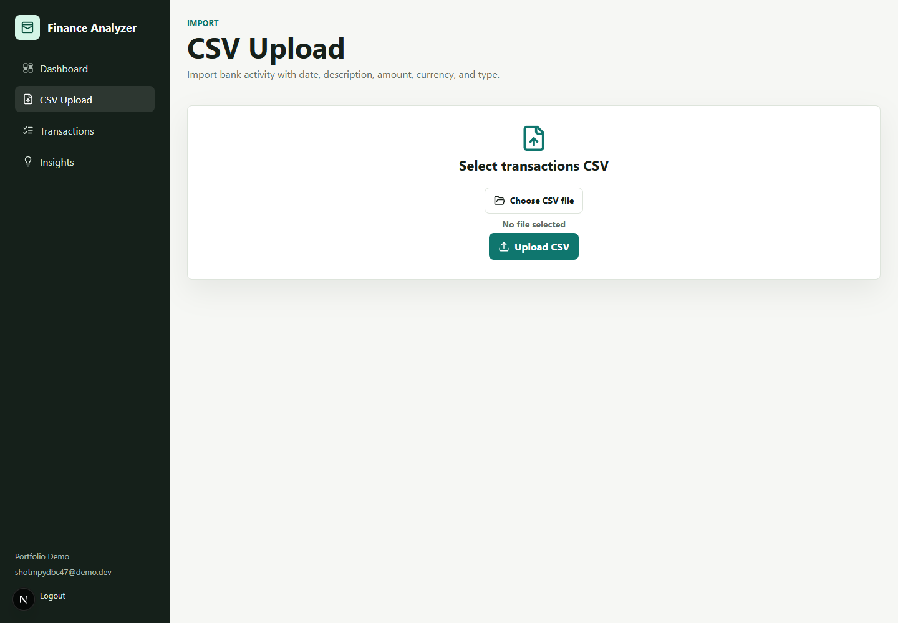
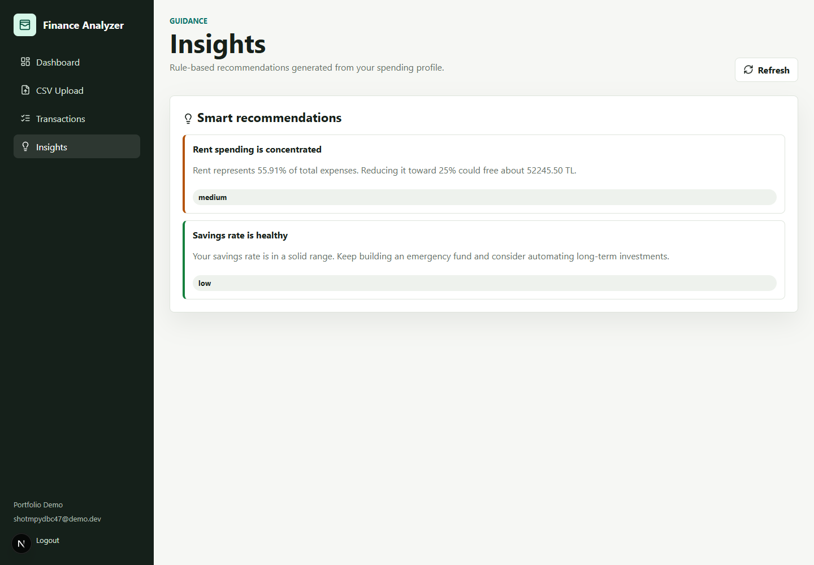

# AI-Powered Personal Finance Analyzer

A full-stack personal finance dashboard for importing bank transactions, classifying spending, calculating financial health, and generating practical budget recommendations.

The first version uses rule-based intelligence by design: it is transparent, testable, and ready for a future ML or LLM-backed classifier without changing the public API.

## Features

- JWT authentication with register, login, and current-user endpoints
- User-scoped transaction storage so each account only sees its own data
- CSV upload with validation for `date`, `description`, `amount`, `currency`, and `type`
- Automatic transaction categorization from description text
- Dashboard metrics for income, expenses, net balance, average daily spending, savings rate, category mix, monthly trend, and top expenses
- Financial health score from 0 to 100 with readable labels
- Rule-based budget recommendations
- Modern Next.js dashboard with Recharts visualizations
- PostgreSQL, FastAPI Swagger docs, Docker, pytest, and Ruff-ready backend setup

## Tech Stack

- Backend: Python, FastAPI, SQLAlchemy, PostgreSQL, JWT
- Frontend: Next.js, TypeScript, Recharts, lucide-react
- Tooling: Docker Compose, Pytest, Ruff, npm

## Project Structure

```text
backend/
  app/
    main.py
    config.py
    database.py
    models/
    schemas/
    routers/
    services/
    utils/
    tests/
frontend/
  app/
  components/
  lib/
  types/
  hooks/
docker-compose.yml
sample_transactions.csv
```

## Quick Start With Docker

```bash
cp .env.example .env
docker-compose up --build
```

Open:

- Frontend: http://localhost:3000
- Backend API: http://localhost:8000
- Swagger docs: http://localhost:8000/docs

## Local Development

Backend:

```bash
cd backend
python -m venv .venv
.venv\Scripts\activate
pip install -e ".[dev]"
uvicorn app.main:app --reload
```

Frontend:

```bash
cd frontend
npm install
npm run dev
```

## Example CSV

The included `sample_transactions.csv` contains more than 50 realistic TL transactions.

```csv
date,description,amount,currency,type
2026-01-01,Salary January,62000,TL,income
2026-01-03,Migros weekly grocery,2450,TL,expense
```

Rules:

- `date` must use ISO format: `YYYY-MM-DD`
- `amount` must be a positive number
- `currency` should be a short code such as `TL`
- `type` must be either `income` or `expense`

## API Endpoints

| Method | Endpoint | Description |
| --- | --- | --- |
| GET | `/health` | Health check |
| POST | `/api/auth/register` | Create a user and return a JWT |
| POST | `/api/auth/login` | Authenticate and return a JWT |
| GET | `/api/auth/me` | Read the current user |
| GET | `/api/transactions` | List current user's transactions |
| POST | `/api/transactions` | Create one transaction |
| POST | `/api/transactions/upload` | Upload a CSV file |
| GET | `/api/analytics/dashboard` | Dashboard metrics and recommendations |
| GET | `/api/analytics/insights` | Recommendations only |

## Screenshots

### Dashboard



### CSV Upload



### Insights



## Future Improvements

- ML-backed transaction classifier
- LLM-powered natural-language financial coaching
- Bank-specific CSV mapping presets
- Monthly budgets and alert thresholds
- Refresh tokens and password reset flow
- Alembic migrations
- CI workflow for backend tests and frontend build

## License

MIT License. See `LICENSE`.
